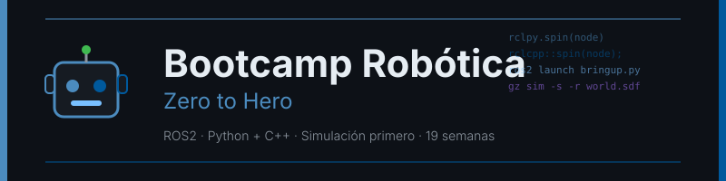

<p align="center">
  
</p>

<p align="center">
  <a href="LICENSE"></a>
  <a href="#"></a>
  <a href="#"></a>
  <a href="#"></a>
  <a href="#"></a>
</p>

<p align="center">
  <a href="README_EN.md"></a>
</p>

---

## 📋 Descripción

Bootcamp intensivo de **19 semanas (~4.5 meses)** enfocado en **robótica con ROS2**,
desde cero absoluto en robótica hasta un robot móvil autónomo con SLAM+Nav2 o un brazo
manipulador con visión y pick&place. Todo verificable en simulación, con **Python y
C++ como lenguajes de primera clase** — no uno relegado a nota al margen.

### 🎯 Objetivos

Al finalizar el bootcamp, los estudiantes serán capaces de:

- ✅ Dominar el grafo computacional de ROS2 (nodos, topics, servicios, acciones, QoS)
- ✅ Escribir nodos equivalentes en `rclpy` y `rclcpp`, y saber cuándo usar cada uno
- ✅ Modelar un robot en URDF/Xacro y razonar sobre su árbol TF2
- ✅ Simular un robot completo en Gazebo Harmonic y verificarlo en modo headless
- ✅ Construir percepción con OpenCV (y detección por deep learning opcional)
- ✅ Fusionar sensores con un EKF y justificar cuándo un nodo necesita C++
- ✅ **Track A**: cartografiar, localizar y navegar de forma autónoma con Nav2,
  incluidos plugins propios en C++
- ✅ **Track B**: planificar movimientos, detectar objetos y ejecutar pick&place
  completo con MoveIt2, incluido un planning adapter en C++
- ✅ Documentar y demostrar un sistema robótico con evidencia reproducible

### 🚀 ¿Por qué este bootcamp?

> **Ambos lenguajes de primera clase desde el día 1** — Python para prototipar y
> orquestar, C++ donde el framework lo exige o hay presupuesto de latencia real.

Instructor y estudiantes parten sin experiencia previa en robótica (aunque sí con
programación previa): el curriculum se apoya solo en documentación oficial y stacks
maduros (ROS2 LTS, Nav2, MoveIt2, Gazebo Harmonic), sin rutas experimentales.

---

## 🗓️ Estructura del Bootcamp

|         Fase          | Semanas | Horas | Temas Principales                                      |
| :--------------------: | :-----: | :---: | ------------------------------------------------------ |
| **1 · Fundamentos ROS2 bilingüe** |   1-5   |  50h  | Grafo/DDS, topics, QoS, servicios, acciones, executors, TF2, URDF — en `rclpy` **y** `rclcpp` |
| **2 · Simulación y percepción**  |  6-10   |  50h  | Gazebo Harmonic, sensores, OpenCV, fusión EKF, detección avanzada |
| **3 · Puente común: cinemática** |  11-12  |  20h  | Cinemática diferencial y de brazo, checkpoint de track/dominio |
| **4 · Especialización (Track A o B)** |  13-17  |  50h  | Track A: SLAM+Nav2 (con plugins C++) · Track B: MoveIt2+visión (con plugins C++) |
| **5 · Capstone**        |  18-19  |  20h  | Integración final, demo, hardware opcional |

**Total: 19 semanas** | **190 horas** de formación intensiva

### 🔀 Dos Tracks, Un Mismo Camino

Las semanas 01-12 son comunes. En la semana 12 se elige el track:

- **Track A · Móvil Autónomo** — SLAM (`slam_toolbox`) + AMCL + Nav2. Capstone: robot
  que mapea, se localiza y navega evitando obstáculos.
- **Track B · Manipulador** — MoveIt2 + visión. Capstone: brazo que detecta un objeto
  y ejecuta pick&place.

Ver [docs/tracks.md](docs/tracks.md) para la política completa (incluye catálogo de
misiones/dominios anticopia).

---

## 📚 Contenido por Semana

Cada semana incluye:

```
bootcamp/week-XX-tema_principal/          # semanas 01-12
bootcamp/track-{a,b}/week-XX-tema/        # semanas 13-19, por track
├── README.md                 # Objetivos y cronograma
├── rubrica-evaluacion.md     # Criterios de evaluación
├── 0-assets/                 # Diagramas SVG
├── 1-teoria/                 # Material teórico
├── 2-practicas/              # Ejercicios guiados (rclpy y/o rclcpp)
├── 3-proyecto/                # Capa semanal del proyecto (track + dominio)
├── 4-recursos/                # ebooks-free/, videografia/, webgrafia/
└── 5-glosario/                 # Términos clave
```

### 🔑 Componentes Clave

- 📖 **Teoría**: conceptos con el porqué antes del cómo, en `rclpy` y/o `rclcpp`
- 💻 **Práctica**: ejercicios guiados (patrón "descomentar"), verificados con
  `colcon test` y simulación headless
- 📝 **Evaluación**: Conocimiento (30%) + Desempeño (40%) + Producto (30%)
- 🎓 **Recursos**: glosarios, referencias oficiales, material complementario

---

## 🛠️ Stack Tecnológico

| Tecnología | Versión | Uso |
|------------|---------|-----|
| ROS2 | **Jazzy Jalisco** | Middleware, LTS |
| Ubuntu | **24.04 LTS** | Sistema base |
| Python | **3.12.3** (`rclpy`) | Prototipado, orquestación, percepción |
| C++ | **17** (`rclcpp`) | Hot path, plugins Nav2/MoveIt2 |
| Gazebo | **Harmonic** (`gz-sim` 8.7.0) | Simulación |
| Nav2 | rama `jazzy` | Navegación autónoma (Track A) |
| MoveIt2 | rama `jazzy` | Manipulación (Track B) |
| OpenCV | **4.10.0.84** | Percepción |
| Docker | **27.5.1** | Entorno de desarrollo obligatorio |

**Entorno de desarrollo**: Docker + WSLg/X11 para GUI de RViz2/Gazebo (❌ NO instalar
ROS2 directamente sobre el sistema operativo salvo la alternativa nativa documentada).

Ver [docs/stack-versions.md](docs/stack-versions.md) para el detalle completo pinneado.

---

## 🚀 Inicio Rápido

### Prerrequisitos

- **Docker** y **Docker Compose** instalados
- **Programación previa en Python y/o C++** (este bootcamp no enseña sintaxis básica)
- **Git** para control de versiones
- **VS Code** (recomendado) con extensiones incluidas

### 1. Clonar el Repositorio

```bash
git clone https://github.com/ergrato-dev/bc-robotica.git
cd bc-robotica
```

### 2. Configurar el Entorno

→ [Guía de configuración con Docker](docs/setup/con-docker.md) (recomendada, incluye
passthrough GUI para RViz2/Gazebo vía WSLg/X11)

### 3. Navegar a la Semana Actual

```bash
cd bootcamp/week-01-fundamentos_ros2_y_workspace
```

### 4. Seguir las Instrucciones

Cada semana contiene un `README.md` con instrucciones detalladas.

---

## 📊 Metodología de Aprendizaje

### Estrategias Didácticas

- 🎯 **Aprendizaje Basado en Proyectos**: un sistema que crece 19 semanas sobre tu
  track y tu misión, nunca un ejercicio desechable
- 🔁 **Descomentar para Aprender**: los ejercicios traen código y tests explicados; se
  aprende leyendo, descomentando y viendo pasar los tests
- 🐍🔧 **Bilingüe desde el día 1**: cada concepto de comunicación (semanas 01-05) se
  implementa en Python y C++, lado a lado
- 🖥️ **Simulación antes que hardware**: todo se valida primero en Gazebo headless; el
  hardware físico es siempre una extensión opcional (ver
  [docs/hardware-opcional.md](docs/hardware-opcional.md))
- 📏 **Mide, no asumas**: benchmarking `rclpy` vs `rclcpp` en las semanas de
  integración de cada track

---

## 📜 Licencia

Este bootcamp está bajo licencia [CC BY-NC-SA 4.0](LICENSE) — uso educativo, no
comercial, las adaptaciones comparten la misma licencia.

## 🤝 Código de Conducta

Ver [CODE_OF_CONDUCT.md](CODE_OF_CONDUCT.md).

## 🔒 Seguridad

Ver [SECURITY.md](SECURITY.md).
