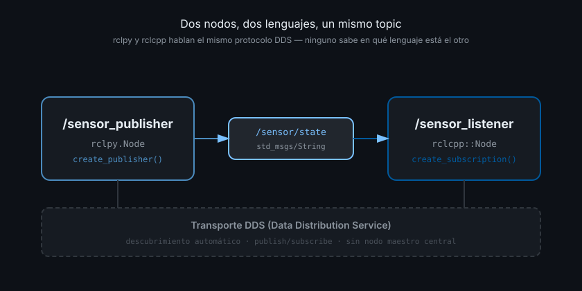

# Qué es ROS2 y el grafo computacional

> ROS2 no es un sistema operativo: es el middleware que hace que las partes de un robot se hablen entre sí sin que tengas que inventar tu propio protocolo de red cada vez.

## 🎯 Objetivos

- Entender qué problema resuelve ROS2 y qué NO es
- Reconocer los bloques del grafo computacional: nodos, topics, servicios, acciones
- Entender qué es DDS y por qué ROS2 no tiene un "maestro" central (a diferencia de ROS1)

## 1. Qué problema resuelve

Un robot real tiene varias piezas de software corriendo a la vez: un driver de cámara,
un algoritmo de detección de objetos, un controlador de motores, un planificador de
ruta. Cada una puede estar escrita por equipos distintos, en lenguajes distintos, y
necesita correr a frecuencias distintas (una cámara publica a 30 Hz, un controlador de
motor puede necesitar 100 Hz o más).

Sin un middleware común, cada par de piezas tendría que ponerse de acuerdo en su propio
protocolo: sockets TCP a mano, formatos de mensaje propios, reconexión manual si algo
se cae. Eso no escala: si tienes 10 nodos, son potencialmente 45 conexiones distintas
que mantener a mano.

**ROS2 resuelve esto dando tres cosas**:

1. Un formato común para "esto es un nodo" y "esto es un mensaje"
2. Un transporte que descubre automáticamente quién publica y quién escucha, sin que
   tengas que configurar IPs a mano
3. Herramientas de línea de comandos (`ros2 topic`, `ros2 node`, `rqt_graph`...) para
   inspeccionar ese sistema en marcha

**Lo que ROS2 NO es**:

- ❌ No es un sistema operativo (no reemplaza Linux; corre sobre él)
- ❌ No es un framework único cerrado — es una colección de librerías (`rclpy`,
  `rclcpp`) más una convención de cómo se organizan los procesos
- ❌ No exige que todo esté escrito en un solo lenguaje — de hecho, esta es la primera
  lección del bootcamp: vas a escribir el mismo nodo en Python y en C++ y van a
  hablarse sin problema

## 2. Cómo funciona: el grafo computacional

Un sistema ROS2 en marcha es un **grafo**: nodos (los procesos) conectados por
**topics** (canales de datos), **servicios** (petición/respuesta) y **acciones**
(tareas largas con progreso). Ningún nodo necesita saber en qué máquina, en qué
lenguaje o en qué proceso corre otro nodo — solo necesita saber el **nombre** del canal
al que se conecta.

```
[Nodo A: cámara] --topic /image_raw--> [Nodo B: detector] --topic /detections--> [Nodo C: planificador]
```

### Nodo

Un **nodo** es un proceso (o parte de un proceso) que hace una cosa: leer un sensor,
correr un algoritmo, mover un actuador. Cada nodo tiene un nombre único en el grafo
(`/camera_driver`, `/object_detector`).

### Topic

Un **topic** es un canal con nombre (`/image_raw`) y un **tipo de mensaje** fijo
(`sensor_msgs/Image`). Cualquier nodo puede **publicar** en él, cualquier nodo puede
**suscribirse**. La comunicación es asíncrona: el publisher no espera respuesta, el
subscriber recibe cada mensaje que llega vía un callback.

### Servicio (adelanto — semana 03)

Petición/respuesta síncrono: un cliente pide algo (`¿cuál es tu estado?`) y espera una
respuesta concreta. Se ve en detalle en la Semana 03.

### Acción (adelanto — semana 03)

Como un servicio, pero para tareas que tardan y que quieres poder cancelar y ver
progreso (`navega a este punto`). También en la Semana 03.

## 3. DDS: por qué no hay un nodo maestro

ROS1 tenía un proceso `roscore` que actuaba de directorio central: todos los nodos se
registraban ahí, y si `roscore` se caía, todo el sistema se caía con él.

**ROS2 usa DDS** (Data Distribution Service) como transporte. DDS es un estándar de la
industria (OMG) para sistemas distribuidos en tiempo real, usado también en aviónica y
sistemas financieros. Su característica clave para nosotros: **descubrimiento
automático**. Cuando un nodo arranca, anuncia por la red local "yo publico en el topic
X con el tipo Y", y cualquier nodo que se suscriba a X lo encuentra automáticamente. No
hay proceso central que coordine esto — si un nodo se cae, el resto sigue funcionando.



Nota algo importante en el diagrama: el nodo de la izquierda está en Python y el de la
derecha en C++, y **ninguno de los dos lo sabe**. DDS no le pregunta a un nodo en qué
lenguaje está escrito el otro — solo le importa el nombre del topic y el tipo de
mensaje. Esta es la base técnica de por qué vas a poder mezclar `rclpy` y `rclcpp`
libremente durante todo el bootcamp.

```python
# ✅ Esto es TODO lo que rclpy necesita para que tu nodo aparezca en el grafo
import rclpy
from rclpy.node import Node

class MyNode(Node):
    def __init__(self) -> None:
        super().__init__("my_node")  # nombre único en el grafo

rclpy.init()
node = MyNode()
rclpy.spin(node)  # mantiene el nodo vivo, procesando callbacks
```

No hay ninguna llamada a "conectar a roscore" — DDS lo hace por debajo.

### `ROS_DOMAIN_ID`: aislar grafos en la misma red

Por defecto, DDS usa multicast: todos los nodos en la misma red local que compartan
`ROS_DOMAIN_ID` (0 por defecto) se ven entre sí. Esto es útil para que dos nodos en dos
máquinas distintas se descubran solos, pero también significa que si tú y tu compañero
de bootcamp están en la misma WiFi con `ROS_DOMAIN_ID=0`, sus grafos se mezclan.

```bash
# ✅ Cada estudiante fija su propio dominio antes de correr nada
export ROS_DOMAIN_ID=42
```

Esto se retoma como regla de seguridad en `docs/tracks.md` y `SECURITY.md`.

## 4. Antipatrones

- ❌ **Pensar en ROS2 como un framework de aplicación única.** Un sistema ROS2 sano son
  muchos nodos pequeños con una responsabilidad cada uno, no un solo nodo gigante que
  hace de todo
- ❌ **Asumir que hace falta un "nodo maestro".** Es un reflejo de quien viene de ROS1;
  en ROS2 no existe, y buscar cómo levantarlo es tiempo perdido
- ❌ **Ignorar `ROS_DOMAIN_ID` en clase o en red compartida.** Vas a ver topics de tu
  compañero de al lado y no vas a entender por qué tu nodo "recibe mensajes raros"

## 5. Trucos

- `ros2 doctor` — diagnóstico rápido del entorno (versión, RMW, variables de entorno)
- `ros2 node list` — qué nodos están vivos ahora mismo en tu `ROS_DOMAIN_ID`
- `ros2 topic list` — qué topics existen ahora mismo
- `rqt_graph` — visualización gráfica del grafo completo, muy útil para depurar

## 📚 Recursos Adicionales

- [Concepts — ROS2 Jazzy docs](https://docs.ros.org/en/jazzy/Concepts.html)
- [About DDS — ROS2 Jazzy docs](https://docs.ros.org/en/jazzy/Concepts/Intermediate/About-Different-Middleware-Vendors.html)

## ✅ Checklist de Verificación

- [ ] Puedo explicar con mis palabras qué es un nodo, un topic y por qué no hay
      "maestro" en ROS2
- [ ] Sé qué hace `ROS_DOMAIN_ID` y por qué me importa en un aula compartida
- [ ] Corrí `ros2 doctor` y `rqt_graph` en mi entorno al menos una vez
