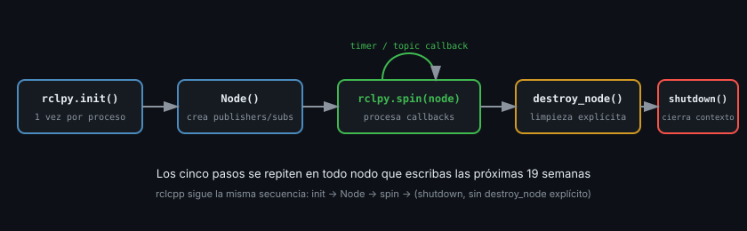

# Primer nodo en Python (`rclpy`)

> `rclpy` es la librería cliente oficial de ROS2 para Python. Un nodo mínimo son cuatro líneas; entender cada una te ahorra confusión durante todo el bootcamp.

## 🎯 Objetivos

- Escribir un nodo `rclpy` mínimo y entender cada línea de su ciclo de vida
- Publicar en un topic con `create_publisher`
- Ejecutarlo con `ros2 run` tras registrarlo en `setup.py`

## 1. Qué problema resuelve

Necesitas una forma de: (1) registrar tu proceso en el grafo ROS2 con un nombre, (2)
crear publishers/subscribers/servicios sobre ese nodo, y (3) mantenerlo vivo
procesando callbacks sin que el programa termine solo. `rclpy.node.Node` es la clase
base que da todo esto.

## 2. Cómo funciona: el ciclo de vida de un nodo

```python
import rclpy
from rclpy.node import Node


class SensorPublisher(Node):
    def __init__(self) -> None:
        super().__init__("sensor_publisher")  # nombre único en el grafo
        # aquí se crean publishers, subscribers, timers...


def main() -> None:
    rclpy.init()                    # inicializa el contexto de ROS2 para este proceso
    node = SensorPublisher()
    rclpy.spin(node)                # bucle: procesa callbacks hasta Ctrl+C
    node.destroy_node()             # limpieza explícita
    rclpy.shutdown()                # cierra el contexto


if __name__ == "__main__":
    main()
```

Cuatro pasos, siempre en este orden:

1. `rclpy.init()` — una vez por proceso, antes de crear cualquier nodo
2. Crear el/los nodo(s) — heredando de `Node` o instanciándolo directo
3. `rclpy.spin(node)` — bloquea el hilo principal, procesando callbacks (timers,
   subscripciones) hasta que el proceso recibe una señal de terminación
4. `destroy_node()` + `rclpy.shutdown()` — limpieza. Técnicamente el proceso terminaría
   igual sin esto, pero dejar handles de DDS sin cerrar explícitamente es un hábito que
   se paga caro en nodos más complejos (semana 04 en adelante, con executors)



Vas a escribir estos cinco pasos, o su equivalente exacto en C++, en cada nodo de las
próximas 19 semanas — vale la pena memorizarlos ahora.

## 3. Cómo se escribe: publisher con timer

```python
import rclpy
from rclpy.node import Node
from std_msgs.msg import String


class SensorPublisher(Node):
    def __init__(self) -> None:
        super().__init__("sensor_publisher")
        self._publisher = self.create_publisher(String, "sensor/state", 10)
        self._counter = 0
        # crea un timer que llama al callback cada 0.5 s
        self._timer = self.create_timer(0.5, self._on_timer)

    def _on_timer(self) -> None:
        msg = String()
        msg.data = f"lectura #{self._counter}"
        self._publisher.publish(msg)
        self.get_logger().info(f"Publicado: {msg.data}")
        self._counter += 1


def main() -> None:
    rclpy.init()
    node = SensorPublisher()
    try:
        rclpy.spin(node)
    except KeyboardInterrupt:
        pass
    finally:
        node.destroy_node()
        rclpy.shutdown()


if __name__ == "__main__":
    main()
```

Nota los tres números en `create_publisher(String, "sensor/state", 10)`:

- `String` — el **tipo** del mensaje (`std_msgs.msg.String`)
- `"sensor/state"` — el **nombre del topic**
- `10` — el tamaño de la **cola de historial** (QoS `depth`). Se explica a fondo en la
  Semana 02; por ahora, piensa en él como "cuántos mensajes recientes guarda ROS2 por
  si un subscriber se conecta tarde"

`self.get_logger()` es el logger propio del nodo — usarlo en vez de `print()` es lo que
hace que tus mensajes aparezcan correctamente etiquetados con el nombre del nodo en
`ros2 topic echo`/`rqt_console` y respeten los niveles de log (`info`, `warn`, `error`).

## 4. Antipatrones

- ❌ **Llamar `rclpy.init()` más de una vez en el mismo proceso** sin un `shutdown()` de
  por medio — lanza una excepción
- ❌ **Usar `print()` en vez de `self.get_logger()`.** Pierdes el nombre del nodo, el
  nivel de log, y la integración con herramientas como `rqt_console`
- ❌ **Hacer trabajo bloqueante largo dentro de un callback de timer/subscripción**
  (ej. una petición HTTP sin timeout). Bloquea el `spin()` y el nodo deja de procesar
  cualquier otro callback mientras tanto — se retoma en la Semana 04 con executors
- ❌ **Olvidar `try/except KeyboardInterrupt`** en `main()`. Sin él, `Ctrl+C` imprime un
  traceback feo en vez de cerrar limpio (funciona igual, pero es una mala primera
  impresión para quien lea los logs)

## 5. Trucos

- `ros2 topic echo /sensor/state` — ver los mensajes que publica tu nodo en vivo
- `ros2 topic hz /sensor/state` — medir la frecuencia real de publicación
- `ros2 node info /sensor_publisher` — ver publishers, subscribers y QoS de un nodo
- `self.get_logger().info(..., throttle_duration_sec=1.0)` — loguea como máximo una vez
  por segundo, útil en callbacks de alta frecuencia

## 📚 Recursos Adicionales

- [Writing a simple publisher and subscriber (Python) — ROS2 Jazzy docs](https://docs.ros.org/en/jazzy/Tutorials/Beginner-Client-Libraries/Writing-A-Simple-Py-Publisher-And-Subscriber.html)
- [rclpy API reference](https://docs.ros2.org/latest/api/rclpy/)

## ✅ Checklist de Verificación

- [ ] Puedo escribir de memoria el esqueleto `init → Node → spin → destroy → shutdown`
- [ ] Sé qué significan los tres argumentos de `create_publisher`
- [ ] Corrí mi nodo con `ros2 run` y vi sus mensajes con `ros2 topic echo`
